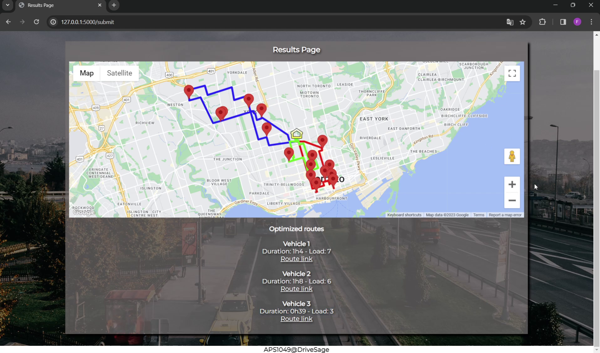
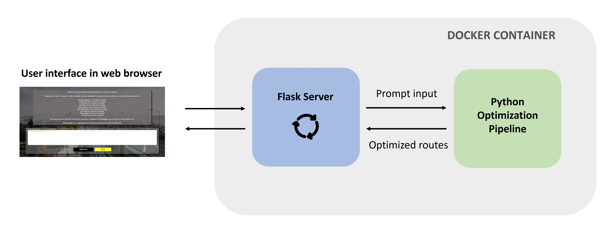

# drivesage_app

<div style="display: flex; justify-content: space-between;">
  
  
</div>

## How to run the code:
- ensure Docker is installed (for windows: https://docs.docker.com/desktop/install/windows-install/)
- create an API_config.yaml file containing your API keys under the following format and place it at the root of the drivesage_app/ folder.
```
# API key configuration
openai:
  api_key: YOUR_OPENAI_API_KEY_HERE

google:
  api_key: YOUR_GOOGLE_API_KEY_HERE
```
Ensure that your Google API key restrictions allow the access to the following APIs: Directions API, Distance Matrix API, Geocoding API, and Maps JavaScript API.

- launch Docker Desktop to automatically start the docker daemon
- build the docker image: `docker build -t my_app .`
- start the application `docker run -p 5000:5000 -it my_app`
- open the local page http://localhost:5000/ or http://127.0.0.1:5000/ in a web browser to access the application

## Documentation

### File Structure:

```plaintext
drivesage_app/
|-- app.py
|-- pipeline.py
|-- templates/
|-- static/
|-- requirements.txt
|-- API_config.yaml
|-- Dockerfile
```

- app.py: Main Flask application.
- pipeline.py: Pipeline code for route optimization.
- templates: Folder containing HTML files.
- static: Folder containing CSS files
- requirements.txt: File listing Python dependencies for the application.
- API_config.yaml: Configuration file containing API keys.
- Dockerfile: File for Docker container configuration.

### Backend Overview



### Pipeline Overview

Given an initial prompt describing a capacitated VRP problem, such as:

```
input = "Starting at 1 Austin Terrace, Toronto, Canada, we have deliveries to make tomorrow
         afternoon at various locations. Here are the addresses:
                King's College Cir, Toronto, Canada;
                8 Adelaide St W, Toronto, Canada;
                1 Dundas St E, Toronto, Canada;
                ...
                1710 Jane St, Toronto, Canada;

         We have three delivery trucks with maximum capacity of 5 packages each.
         Please assist us in organizing the route to minimize the total driving time."
```

**→ Step 1: Extraction of relevant data from the prompt using GenAI**

We use the `extract_data` function that sends a pre-engineered instruction prompt and the `input` to OpenAI API to extract using gpt-3-turbo the information in the required format for Google OR-tools.

`data = extract_data(input)`

`data` is a Python dictionary that contains the following information:
- warehouse address
- list of customer addresses
- size of each order
- number of available vehicles
- maximum capacity of each vehicle
- maximum shift length
- date & time for the overall delivery process  


**→ Step 2: Computation of the cost matrix**

We use the `compute_cost_matrix` function that calls the Google Maps Distance Matrix API to compute the cost matrix for the given list of addresses. The matrix element i,j represents the cost to travel from location i to location j. We add the result to the `data` dictionary.

**→ Step 3: Finding the optimized routes using Google OR-tools**

We call the `CVRP_solver` that is based on the Google OR-tools package to solve the VRP problem and obtain the optimal routes.

`optimal_routes = CVRP_solver(data)`

**→ Step 4: Generation of maps & route directions**

`generate_visualization_map` function generates an html page embedding an interactive map with all the routes displayed

`generate_google_maps_directions_link` function generates for a given route a google map direction link ready to use that can be send to the driver.

## Discussion

### Types of constraints

Right now, this pipeline can solve routing problems with several vehicles with heterogeneous capacity constraints (HCVRP). Yet, the VRP solver code used here can be adapted to account for other constraint types with enough knowledge of the Google OR-tools. For instance, by changing the function that Google OR-tools is trying to minimize, we can define whether we want to minimize the total distance driven or to minimize the maximum distance driven by our drivers (i.e. sharing the load as much as possible). We can also do anything in between by defining a more complex function that could for example take into account the cost of using additional drivers or renting bigger trucks.

### Architecture choice and Online Deployment 

While the application is currently running locally, it has been designed using Docker to encapsulate both the application and its dependencies. This containerization approach ensures that the application operates consistently across various environments. This design choice also facilitates the online deployment of the application on web applications host service such as Heroku, providing a seamless experience to deploy, manage, and scale containerized applications.

### Cost Analysis

The below costs are from December 2023, please check online the up-to-date cost.

- OpenAI API gpt-3.5-turbo
    - Input: $0.0010 / 1K tokens
    - Output: $0.0020 / 1K tokens

The instruction prompt used below is about 350 tokens long and the longest input tested at the end is about 600 tokens. The output length is similar to the input as the addresses make most of the token count and have to be transcribed in the output.

Therefore, the OpenAI cost is around \$0.003 / pipeline run and it grows linearly with the problem instance size.

- Google Maps Platform API
    - Directions API & Maps JavaScript API

    \$0.01 per route request. The cost here depends of the number of vehicle. In our examples, the price is around \$0.05 / pipeline run.
    
    - Geocoding API

    \$0.005 per request, i.e. per addresses in the problem instance. In our examples, the price is around \$0.1 / pipeline run.

    - Distance Matrix API

    \$0.01 per element where the number of elements is the number of origins times the number of destinations, i.e. in our case the number of addresses squared. For a problem instance with 10 addresses, the cost will be 10 * 10 * 0.01 = \$1. This is the most expensive component of our pipeline as the price grows quadratically with the problem instance size.

Therefore, the Google Maps cost is around \$1 / pipeline run, driven by the Distance Matrix API cost, and it grows quadratically with the problem instance size.

Note that Google offers 200$ free credits per month to use its API.

### Running time

For the instances we tested, our code took around 30-60 secs to run. While one would naturally assume that this time is taken to find the shortest routes, the optimization solver takes only 1 second to find the optimal route. Most of the time is taken by the OpenAI API call in the extraction function to extract the different information. As in ChatGPT, the response returned by the OpenAI API is generated token by token and this can take some time especially when there are a lot of addresses to extract and return. The more customers we have, the more addresses have to be extracted. The running time scales linearly with the size of the problem instance.
